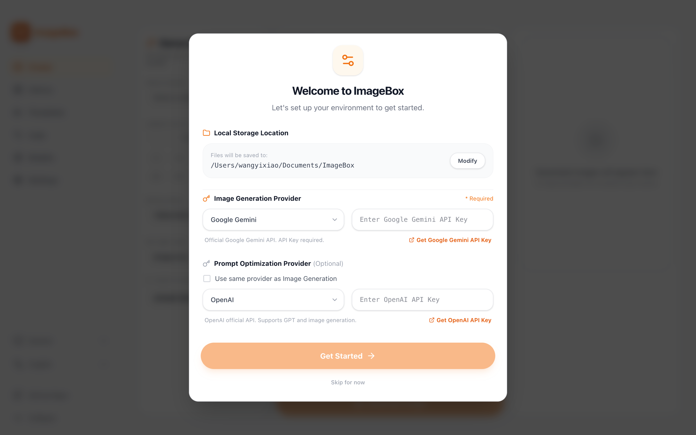
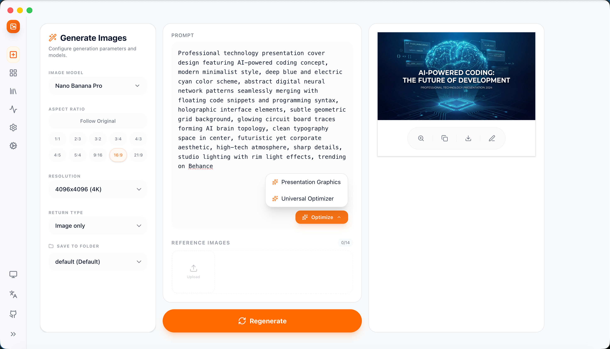
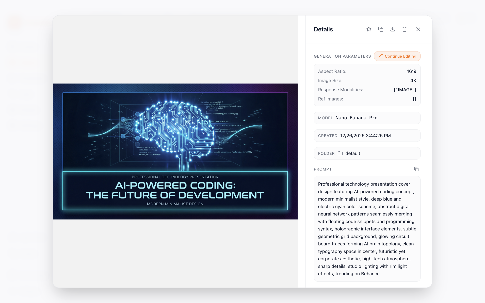
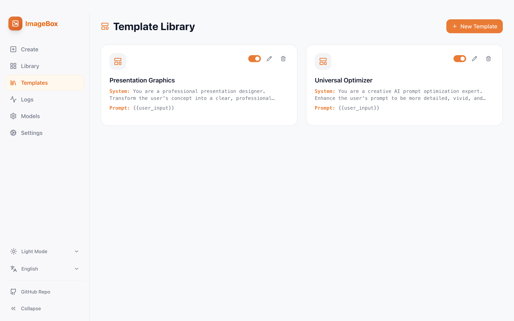
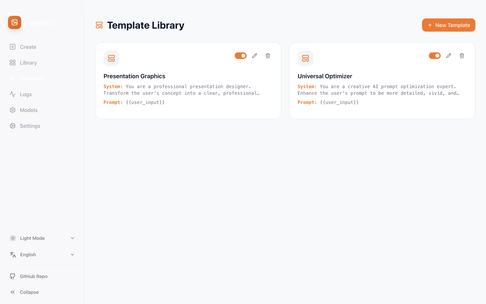
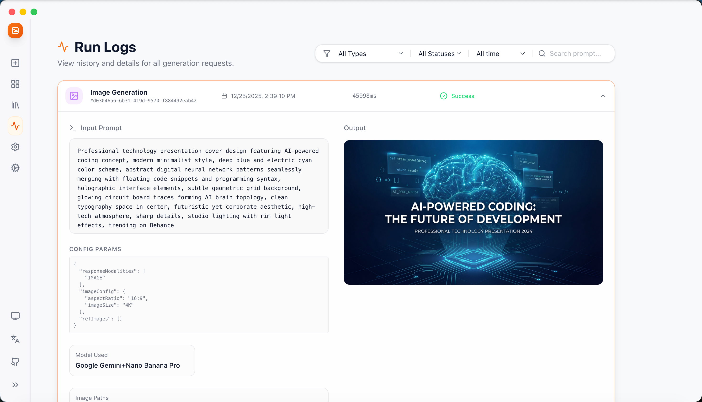
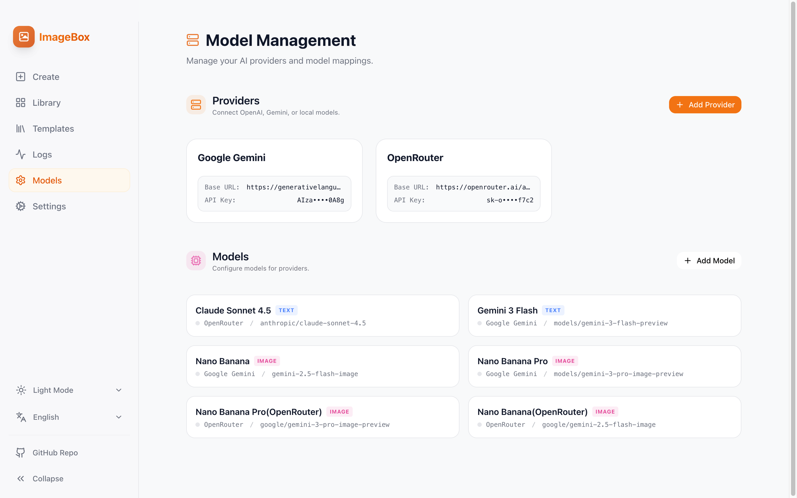
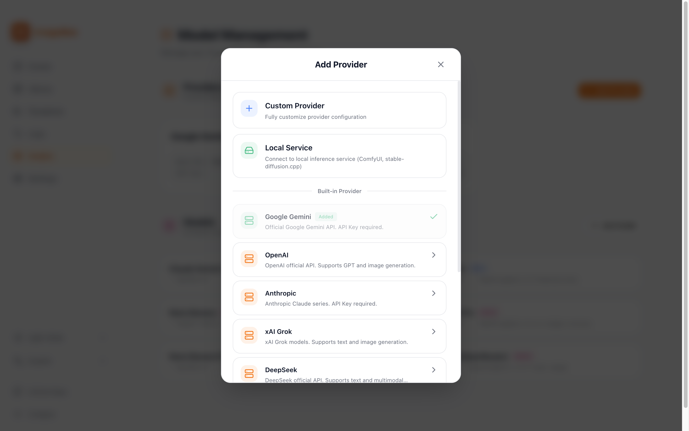
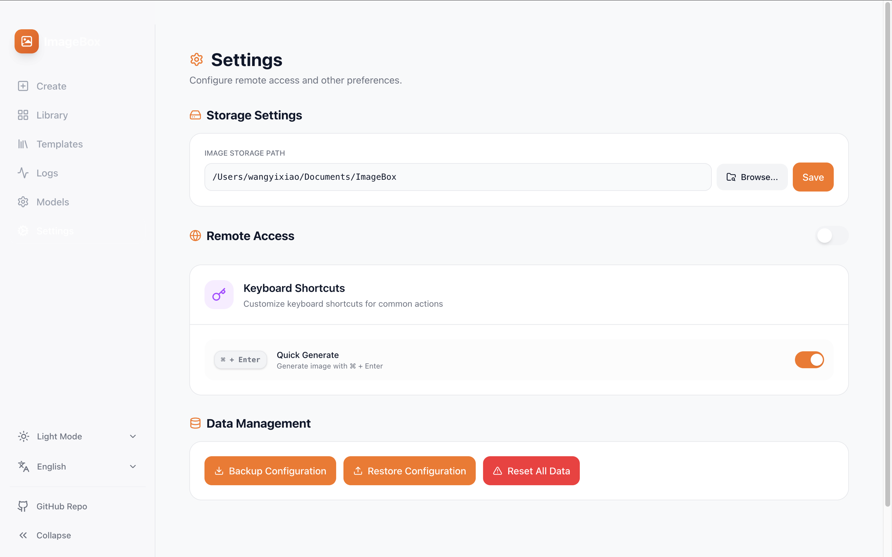

# ImageBox

<div align="center">

**A local-first AI image generation tool**

[](https://nextjs.org/)
[](https://reactjs.org/)
[](https://www.typescriptlang.org/)
[](https://www.prisma.io/)
[](https://opensource.org/licenses/MIT)

[English](README.md) | [简体中文](README.zh-CN.md)

</div>

---

## Overview

**ImageBox** is a completely free, local-first AI image generation tool built with Next.js 16. Generate stunning AI images using Google Gemini 3 Pro, manage reusable templates, and organize all your creations locally. Available as both a web application and a native desktop app (macOS, Windows, Linux). No cloud storage, no subscriptions, no data collection—just pure creative freedom on your machine.

## ✨ Feature Highlights

### 1. 🚀 Effortless Initialization
Get started in seconds. The Setup Wizard guides you through selecting your **Local Storage Path** and configuring your AI **Provider** in one click.


### 2. 🎨 Professional Generation Experience
Supports both **Text-to-Image** and **Image-to-Image**. Built-in **Prompt Optimization** turns simple ideas into professional instructions. Supports **Continue Editing** to iterate on your creations step-by-step.


### 3. 🔍 Precision Detail Control
Inspect generation details and continue refining. Keep your parameters, tweak the prompt, and iterate until it's perfect.


### 4. 📂 Private Local Library
All your creations are **stored locally**. No privacy concerns—manage your AI art just like local files. Browse and filter with ease.


### 5. 📝 Smart Template Management
Stop repeating yourself. Save your favorite **Prompt Templates**, support variable substitution, and reuse high-quality Prompts with one click to boost workflow efficiency.


### 6. 📊 Comprehensive Run Logs
Full **Run Logs** record generation parameters, timing, and results. Every spark of inspiration is worth recording for easy backtracking and review.


### 7. 🔌 Flexible Model Switching
Built-in support for major providers—just configure your **API-Key**. Also supports local image generation services (in progress), giving you full control over your compute.



### 8. 🛡️ Powerful Settings Center
Supports **Custom Storage Paths** and **Remote Access**. Provides password-protected **Data Backup/Restore** for worry-free resets and migrations.


## Quick Start

### Option 1: Desktop Application (Recommended)

Download the latest pre-built desktop application for your platform:

**📦 [Download from GitHub Releases](https://github.com/Octo-o-o-o/ImageBox/releases/latest)**

- **macOS**: `ImageBox-{version}-mac-{arch}.dmg` (Intel: x64, Apple Silicon: arm64)
- **Windows**: `ImageBox-{version}-win-x64.exe` (NSIS installer)
- **Linux**: `ImageBox-{version}-linux-x64.AppImage` or `.deb`

After installation:
1. Launch the ImageBox app
2. Follow the setup wizard to configure your storage location
3. Add your AI provider API key in Settings → Models
4. Start creating!

### Option 2: Docker (Recommended for Servers)

Pull and run the pre-built Docker image:

```bash
# Pull the latest image
docker pull octoooo/imagebox:latest

# Run with persistent data volume
docker run -d \
  --name imagebox \
  -p 3000:3000 \
  -v imagebox-data:/app/data \
  octoooo/imagebox:latest
```

Open [http://localhost:3000](http://localhost:3000) in your browser.

**Docker Notes:**
- Multi-arch support: amd64 (Intel/AMD) and arm64 (Apple Silicon, Raspberry Pi)
- Data persisted in `imagebox-data` volume (database + generated images)
- Available tags: `latest`, `v0.1.3`, etc.

### Option 3: Web Application (Development/Self-Hosted)

#### Prerequisites

- Node.js 18+ installed
- Google Gemini API key (free tier available at [Google AI Studio](https://makersuite.google.com/app/apikey))

#### Installation

##### For Windows Users

**Important:** This repository includes a `.npmrc` file that automatically configures npm to use Chinese mirror sources (Taobao/npmmirror) for faster and more reliable package downloads, especially for Electron binaries. This solves common network issues when installing dependencies in mainland China.

```bash
# Clone the repository
git clone https://github.com/Octo-o-o-o/ImageBox.git
cd ImageBox

# Clean npm cache (recommended for first-time installation)
npm cache clean --force

# Install dependencies
# The .npmrc file will automatically use mirror sources for npm packages and Electron
npm install

# Initialize database
npm run db:setup

# Start development server
npm run dev
```

**Troubleshooting Installation Issues:**

If you encounter a `better-sqlite3` module error when running `npm run dev` (e.g., `NODE_MODULE_VERSION` mismatch), this means the native module was compiled for a different Node.js version:

```bash
# Solution 1: Rebuild the native module (recommended)
npm rebuild better-sqlite3

# Solution 2: Reinstall all dependencies (if rebuild doesn't work)
rm -rf node_modules
npm install
```

This issue occurs because `better-sqlite3` is a native C++ module that needs to be compiled for your specific Node.js version. The rebuild command will recompile it for your current Node.js version.

**Troubleshooting Windows Installation:**

If you encounter network errors during `npm install` (e.g., `RequestError: Client network socket disconnected`), try the following:

1. **Verify .npmrc exists**: The repository includes a `.npmrc` file. Make sure it wasn't deleted.

2. **Use environment variables** (if .npmrc doesn't work):
   ```bash
   # In Command Prompt (CMD):
   set ELECTRON_MIRROR=https://npmmirror.com/mirrors/electron/
   npm install

   # Or in PowerShell:
   $env:ELECTRON_MIRROR="https://npmmirror.com/mirrors/electron/"
   npm install
   ```

3. **Skip Electron download temporarily** (if still failing):
   ```bash
   set ELECTRON_SKIP_BINARY_DOWNLOAD=1
   npm install
   ```
   Note: This will skip Electron binary download. You can download it manually later or use the web version only.

4. **Check proxy settings** (if using VPN/proxy):
   ```bash
   npm config get proxy
   npm config get https-proxy

   # Clear proxy if not needed:
   npm config delete proxy
   npm config delete https-proxy
   ```

For more Windows-specific troubleshooting, see [WINDOWS_TROUBLESHOOTING.md](./WINDOWS_TROUBLESHOOTING.md).

##### For Linux/macOS Users

```bash
# Clone the repository
git clone https://github.com/Octo-o-o-o/ImageBox.git
cd ImageBox

# Install dependencies
npm install

# Initialize database
npm run db:setup

# Start development server
npm run dev
```

**Note for international users:** If you experience slow download speeds outside China, you can delete or rename the `.npmrc` file to use default npm registry:

```bash
# Backup .npmrc (optional)
mv .npmrc .npmrc.backup

# Then run npm install
npm install
```

Open [http://localhost:3000](http://localhost:3000) in your browser.

### Updating to Latest Version

If you already have ImageBox installed and want to update to the latest version:

#### Option 1: Normal Update (Preserves Local Changes)

```bash
# Navigate to your ImageBox directory
cd ImageBox

# Stop the running server (Ctrl+C if running)

# Pull the latest changes from GitHub
git pull origin main

# Install any new dependencies
npm install

# Update database schema (if changed)
npm run db:setup

# Restart the server
npm run dev
```

#### Option 2: Force Update (Discard All Local Changes)

**⚠️ Warning:** This will completely overwrite your local code with the remote version. Your data (database and generated images) will be preserved, but any code modifications you made will be lost.

```bash
# Navigate to your ImageBox directory
cd ImageBox

# Stop the running server (Ctrl+C if running)

# Fetch the latest changes from GitHub
git fetch origin

# Force reset to match the remote repository exactly
git reset --hard origin/main

# Clean any untracked files (optional, be careful!)
# git clean -fd

# Install any new dependencies
npm install

# Update database schema (if changed)
npm run db:setup

# Restart the server
npm run dev
```

**Note:** Your existing data (images, templates, models, settings) will be preserved during updates. The `prisma db push` command safely applies schema changes without losing data.

### First-Time Setup

1. Navigate to **Models** page (`/models`)
2. Add a new Provider and configure your API key
3. Add a new Model and select the appropriate provider
4. Go to **Create** (`/create`) and start generating images!

### Remote Access Setup (Optional)

If you want to access ImageBox from other devices on your network:

1. Navigate to **Settings** page (`/settings`)
2. Enable **Remote Access** toggle
3. Click **Create Access Token**
4. Choose an expiration time and add a description (optional)
5. Copy the generated token and access link
6. On your remote device, visit the access link and enter the token
7. You're now securely connected!

**Security Tips:**
- Use shorter expiration times for better security
- Create separate tokens for different devices
- Revoke tokens when no longer needed
- Keep your tokens private - they grant full access to your ImageBox instance

## Usage

### Creating Templates

1. Go to **Templates** page (`/templates`)
2. Click **New Template**
3. Add variables using `{{variableName}}` syntax (e.g., `{{subject}}`, `{{style}}`)
4. Save and use in Create page

**Example Template:**
```
A beautiful {{subject}} in {{style}} style, highly detailed, 4k
```

### Generating Images

1. Go to **Create** page (`/create`)
2. Enter a prompt or select a template
3. Fill in template variables if applicable
4. (Optional) Upload reference images or continue editing from Library
5. Click **Generate**
6. View results in **Library** (`/library`)

**Pro Tip**: Click "Continue Editing" on any generated image in the Library to add it as a reference image for further refinement!

## Tech Stack

- **Framework**: Next.js 16 (App Router, React Server Components)
- **Desktop**: Electron 39 (Native cross-platform wrapper)
- **Database**: SQLite via Prisma ORM
- **Styling**: Tailwind CSS v4 + Framer Motion
- **AI Model**: Google Gemini 3 Pro (`gemini-3-pro-image-preview`)
- **Language**: TypeScript 5

## Project Structure

```
imagebox/
├── app/
│   ├── page.tsx              # Home page (redirects to /library)
│   ├── library/page.tsx      # Image gallery and management
│   ├── create/page.tsx       # Image generation interface
│   ├── templates/page.tsx    # Template management
│   ├── models/page.tsx       # Model & provider configuration
│   ├── settings/page.tsx     # Settings (remote access, storage)
│   ├── run_log/page.tsx      # Generation history logs
│   ├── wizard/page.tsx       # First-time setup wizard
│   ├── auth/login/page.tsx   # Remote access login page
│   ├── api/
│   │   ├── auth/             # Authentication endpoints
│   │   ├── images/           # Image serving API & thumbnails
│   │   └── browse-folders/   # Folder browser API
│   ├── actions.ts            # Server Actions (DB + API)
│   └── layout.tsx            # Root layout with navigation
├── components/
│   ├── Sidebar.tsx           # Navigation sidebar
│   ├── ThemeProvider.tsx     # Theme management
│   ├── LanguageProvider.tsx  # I18n support
│   └── FolderBrowser.tsx     # Storage path browser
├── electron-src/             # Electron main process (TypeScript)
│   ├── main.ts               # Main process entry
│   ├── preload.ts            # Preload scripts
│   ├── database.ts           # Database initialization
│   ├── tray.ts               # System tray integration
│   ├── shortcuts.ts          # Global shortcuts
│   └── updater.ts            # Auto-update handling
├── lib/
│   ├── prisma.ts             # Prisma client singleton
│   ├── modelParameters.ts    # Parameter mapping system
│   ├── imageUrl.ts           # Image URL utilities
│   ├── env.ts                # Environment configuration
│   ├── paths.ts              # Path utilities
│   └── i18n/                 # Translation files
├── prisma/
│   └── schema.prisma         # Database schema
├── assets/                   # Desktop app assets
│   ├── icon.png              # App icon
│   └── splash.html           # Splash screen
├── electron-builder.yml      # Desktop app build config
├── middleware.ts             # Auth & access control
└── public/generated/         # Generated images (auto-created)
```

## Roadmap

### ✅ Completed Features
- [x] **Internationalization (i18n)** - 13 languages with RTL support for Arabic
- [x] **Dark/Light Theme** - User-selectable theme with smooth transitions and system detection
- [x] **Multi-Model Support** - Google Gemini 2.5/3 Pro, OpenAI DALL-E 3, and OpenAI-compatible endpoints
- [x] **Remote Access System** - Token-based authentication with flexible access control
- [x] **Custom Storage Paths** - Configurable image storage directory with validation
- [x] **Folder Organization** - Folder-based image management system
- [x] **Image Favorites** - Star/favorite functionality for quick access
- [x] **Native Desktop App** - Cross-platform Electron wrapper with system tray (i18n), shortcuts, and auto-updates
- [x] **Setup Wizard** - First-time configuration guide for seamless onboarding
- [x] **System Tray i18n** - System tray menu supports 13 languages with auto-detection
- [x] **Cross-Platform Stability** - Improved Windows support with async IPC for language detection
- [x] **Thumbnail Generation** - Optimized image thumbnails for faster gallery loading
- [x] **Advanced Image Preview** - Full-featured modal with zoom, pan, and quick actions
- [x] **Performance Optimization** - Buffer-based image processing and async thumbnail generation

### High Priority
- [ ] **Local Model Support (In Development)** - Run AI models completely offline on your own hardware
  - Hardware detection (NVIDIA GPU, Apple Silicon)
  - Automatic service discovery for local inference servers
  - Support for stable-diffusion.cpp, ComfyUI, and other backends
  - Model installer and version management
- [ ] **Advanced Search & Filtering** - Search images by prompt, date, model, tags
- [ ] **Batch Generation** - Generate multiple images from one prompt
- [ ] **Image Tagging System** - Custom tags for better organization

### Medium Priority
- [ ] Enhanced generation controls (negative prompts, seeds, advanced parameters)
- [ ] Export & sharing features (ZIP export, shareable links)
- [ ] Stable Diffusion integration
- [ ] Image editing and variations

### Future Enhancements
- [ ] Performance optimizations (virtual scrolling, lazy loading)
- [ ] Database backup/restore functionality
- [x] Docker multi-arch deployment (amd64/arm64 via GitHub Actions)
- [ ] Mobile-responsive interface improvements

## Contributing

Contributions are welcome! Please feel free to submit a Pull Request.

1. Fork the repository
2. Create your feature branch (`git checkout -b feature/AmazingFeature`)
3. Commit your changes (`git commit -m 'Add some AmazingFeature'`)
4. Push to the branch (`git push origin feature/AmazingFeature`)
5. Open a Pull Request

## Development

### Web Application

```bash
# Install dependencies
npm install

# Start dev server with hot reload
npm run dev

# Build for production
npm run build

# Start production server
npm start

# View database with Prisma Studio
npm run db:studio

# Lint code
npm run lint
```

### Desktop Application

```bash
# Development mode (with Next.js dev server)
npm run electron:dev

# Build desktop app for current platform
npm run electron:build

# Build for specific platforms
npm run electron:build:mac     # macOS (Intel & Apple Silicon)
npm run electron:build:win     # Windows x64
npm run electron:build:linux   # Linux (AppImage & deb)

# Build for all platforms
npm run electron:build:all

# Publish to GitHub Releases
npm run electron:publish
```

## License

This project is licensed under the MIT License - see the [LICENSE](./LICENSE) file for details.

## Acknowledgments

- Built with [Next.js](https://nextjs.org/)
- Powered by [Google Gemini AI](https://deepmind.google/technologies/gemini/)
- Styled with [Tailwind CSS](https://tailwindcss.com/)
- Animated with [Framer Motion](https://www.framer.com/motion/)

## Support

If you find this project helpful, please consider:
- Starring the repository ⭐
- Sharing it with others
- [Opening an issue](https://github.com/Octo-o-o-o/ImageBox/issues) for bugs or feature requests

---

<div align="center">

Made with ❤️ by the open source community

</div>
